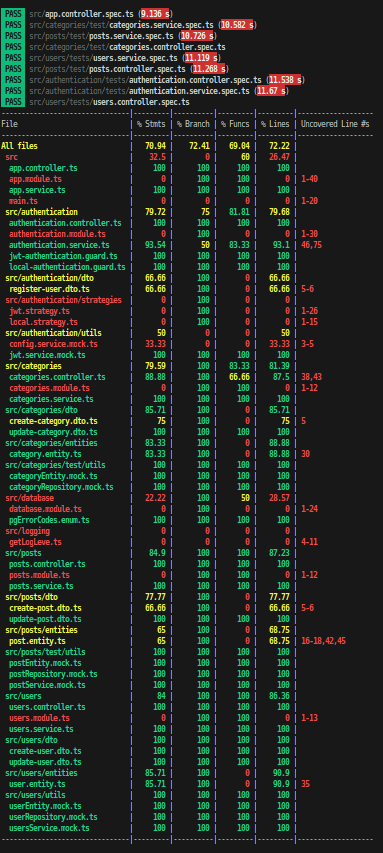

# Social API 🌐

Headless CMS. Fully tested (tests are awesome). Applying thoughtful design decisions and modularity. My intention is to create an MVP open for extension, allowing me to tailor it to future needs.

This way the API remains agnostic of the type of GUI, delegating the use case to the said frontend.

## Index 📚

1. [Process](#process)
2. [Testing](#testing)
3. [Goals](#goals)
4. [On Progress](#on-progress)
5. [Side Quest](#side-quest)
6. [Future Steps](#future-steps)

## Process 🛠️

Docker-compose files for dev and test environment.

Building and running the `docker-compose.yml` and `docker-compose.test.yml` files should be trivial. The latter file only spins up a database to be able to run the tests from the command line.

## Testing 🧪

E2E tests run on the same database. As an own project, I wanted to explore the challenges it would bring to test without mocking the db or using an in-memory one.

Tests are currently run sequentially to allow for more control during the process. I may explore parallel execution in the future.

I implemented a small script that runs a Jest setup to clear the db before all testing modules are created and executed. This way, I can be sure the db is clean **before** the e2e tests run. Cleanup is not done between test suites.

> Testing with watch mode is in the process of being fixed. Because it is a small personal project, this is not a priority at the moment. The issue is the script does not run between retests in watch mode.

## Goals 🎯

Provide a CMS for freelancers, artists, maybe even lawyers—who knows? Anyone who wants a personalized kind of blog.

For people that do not want to build their own website.

I have noticed that the easier it is to build it without code, the more restrictions in design there are. Also, many CMS are subscription-based. The goal is ownership of software (which is not a good business for me, the developer). The client buys the software and just pays for domain and hosting directly.

### First Steps 🚀

User auth, posts, categories, and different media types.

Users can manage their posts. This may or may not have categories and content. I want it to be flexible.

As this is the MVP and base project, it may grow to a social blogging site. There are many scenarios possible.

## On Progress 🔄

Category CRUD + addCategoryToPost + removeCategoryFromPost

> Should the category name be unique? Yes. The testing relies on e2e tests, where the database is not mocked, so the entity may throw a duplicate key constraint violation.

## Side Quest 🏆

On my way to get 100% coverage

## Future Steps 🔮

1. Files inside PostgreSQL
2. JWT Refresh token
3. Postgres indexes
4. DB transactions
5. Pagination
6. Microservices? RabbitMQ & gRPC?
7. Load Testing
8. CQRS
9. Redis
10. GraphQL
11. Queues
12. Confirming the email address
13. Logging
14. RBAC
15. Swagger
